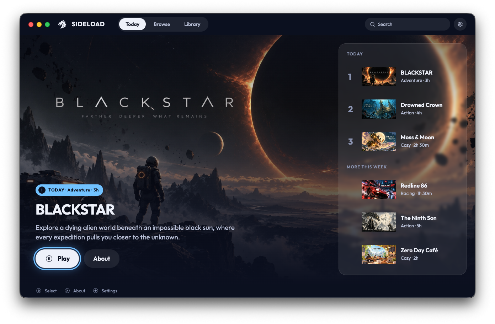

# Sideload

[](https://github.com/DRNKNDev/SideloadPlay/releases/latest)

A desktop launcher for web games, built around a controller.



Three.js, React Three Fiber, Babylon, PlayCanvas: games that already run in a
browser, played from the couch instead of a tab. Every game streams when you
launch it and runs sandboxed, so nothing is installed and nothing is left on
disk.

Playing needs nothing but the launcher. Publishing needs an invite token: there
is no sign-up, so ask [@DRNKNDev](https://x.com/DRNKNDev) for one. If you don't
have one yet, the rest of this still tells you what publishing involves.

## Installing the launcher

Download the latest `.dmg` from
[Releases](https://github.com/DRNKNDev/SideloadPlay/releases). Each release
has notes saying what changed. macOS on Apple Silicon only, for now.

Builds are signed and notarized, so Gatekeeper opens them without complaining.
After that the launcher keeps itself up to date: a new version downloads in the
background and is applied when you next quit, so you should not need this page
again.

## Publishing a game

Publishing runs through a CLI. There is nothing in this repository to build or
run.

```sh
npx sideloadplay --help
```

That is the whole install. Nothing to add globally, nothing to configure. The
command reference, the `sideload.json` shape, and the artwork requirements are
on [npm](https://www.npmjs.com/package/sideloadplay), and this file does not
repeat them.

## Working with an agent

```sh
npx skills add DRNKNDev/SideloadPlay
```

That installs the skills in this repository, for coding agents that follow the
Agent Skills format.

[`skills/sideloadplay/`](./skills/sideloadplay/SKILL.md) prepares a listing.
Ask an agent to prepare one and it can write `sideload.json`, produce the
artwork that references, and run `sideload validate` until the listing passes.
It teaches the rules up front rather than letting you find them one failed
check at a time.

[`skills/sideloadplay-controller/`](./skills/sideloadplay-controller/SKILL.md)
adds controller support to the game itself. The ordinary Gamepad API is all the
launcher hands a game, but four things about it are not obvious: no user
gesture is needed, only one pad slot is ever filled, `gamepadconnected` carries
a plain `Event`, and three buttons never arrive because the launcher keeps
them. It also covers what makes a pad feel right rather than merely work — a
radial dead zone, delta-time scaling, analogue triggers, and stick aiming that
does not depend on pointer lock, which a controller player may never grant.
Reach for it when controller input behaves differently inside the launcher than
in a browser.

Neither one signs in, publishes, or asks for your invite token. Only
`sideload login` touches that, and only by reading it from standard input. The
first writes listing files; the second changes your game's code.

## Reporting a problem

Open an [issue](https://github.com/DRNKNDev/SideloadPlay/issues). A launcher
crash, a failed publish, a listing that renders wrong: all of it belongs here.
